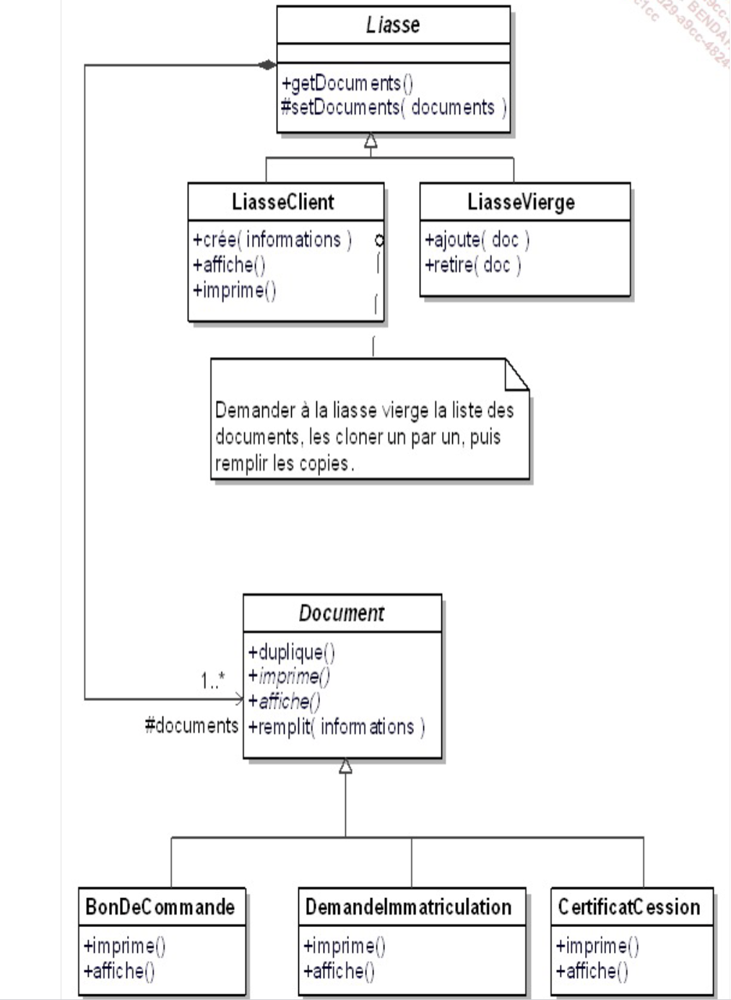
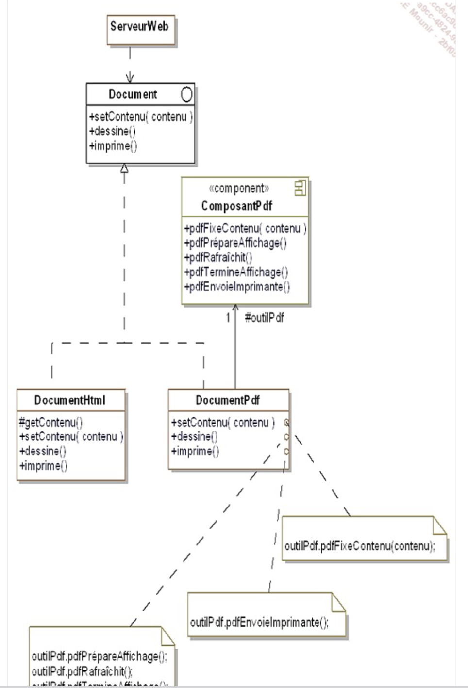

# ESI 4 - DESIGN PATTERNS EN C#

Livre : Design Patterns de 1995

## Chapitre 1​ Introduction aux patterns de conception

### 1.1. Design patterns ou patterns de conception

- Schema d'objets qui forme une solution a un probleme connu et frequent
- Ensemble de classes et de relation
- Dans le cadre de la POO
- Bases sur les bonnes pratiques

Patterns introduit pour la premiere fois dans le livre dit "GoF", Gang of Four en 1995.

Shéma en UML

### 1.2. La description des patterns de conception

- Le language UML et le C# (java, ...)
- Pour chaque pattern :
    - Nom
    - Description
    - Exemple sous forme UML
    - Structure generique du pattern
    - Le cas d'utilisation
    - Un exemple de code C#
    - (lien)


## ​​Chapitre 2 ​Une étude de cas : la vente en ligne de véhicules

### 2.1. Description du système

### ​2.2. Cahier des charges

- Vehicules destines a la vente
- Catalogue
- Options
- Panier / gestion de commandes

## ​​​​Chapitre 3​ Introduction aux patterns de construction

Une interface donne des éléments commun a toute les classes qui l'implemente.

### 3.2. Les problèmes liés à la création d’objets

En C#, une instruction de creation de classe :
```csharp
objet = new MyClass(); // creation d'une instance de la classe MyClass
```

Dans certains cas il est necessaire de parametrer la construction d'objets :

```csharp
public class Document
{
    public string Title { get; set; }
    public string Content { get; set; }
    public string Author { get; set; }
    public DateTime Created { get; set; }
}

public class Program {
    public Document CreateDoc(string typeDoc)
    {
        Document doc = null;

        if (typeDoc == "Word")
        {
            doc = new Document();
            doc.Title = "New Document";
            doc.Content = "Content";
        }
        else if (typeDoc == "Excel")
        {
            doc = new Document();
            doc.Title = "New Excel Document";
            doc.Content = "Excel Content";
        }
        else
        {
            doc = new Document();
            doc.Title = "New Document";
            doc.Content = "Content";
        }
    }
}

```

## Chapitre 4 Le pattern Abstract Factory

Créer un projet : dotnet new console -o NomDuProjet
Build : dotnet build
Run : dotnet run

### 4.1. Description

- Le but du pattern est la creation d'objets regroupes en familles sans devoir connaitre les classes concretes destinées a la création de ces objets.

- Signature de méthode : public void Document()


## Chapitre 5​ Le pattern Builder

### 5.1. Description

Composition : Mécanisme permettant a une classe de contenir une instance de cette meme classe ou d'une autre

.png>)

## Chapitre 7 Le pattern Prototype

### 7.1. Description

- Création de nouveaux objets par duplication d'objets existants
- On les appelle Prototype
- Capacité de clonages 



### 7.4. Domaines d’utilisation

- Le design pattern Prototype permet de créer des copies d'objets existants sans rendre le code dépendant de leurs classes concrètes. Au lieu de créer un objet a partir de zéro, on clone un objet existant (le prototype) et on le modifie si besoin.
- C'est comme faire une photocopie d'un document : on copie l'original et on peut modifier la copie
- L'avantage ^rincipal est la création d'objets complexes simplifié
- Cas d'usage :
    - Objets avec de nombreuse configuration (editeur graphique : formes geometriques)
    - En jeux vidéo, création d'enemis et leur variations en grande quantité
    - Création d'une configuration par defaut dans un jeu/logiciel (permet de restaurer le defaut rapidement et de configurer a nouveau)
    - Pour éviter la création d'objets systèmes couteux : connexions réseaux, ressources partagées...


## Chapitre 8 Le pattern Singleton

### 8.1. Description

- Le pattern Singleton permet d'assurer qu'une classe ne possede qu'une seule instance au cours de l'execution du programme
- Une methode de classe unique qui retourne cette instance

## Chapitre 9​ Introduction aux patterns de structuration

### 9.1. Présentation

- Facilite l'indépendance de l'interface d'un objet vis-à-vis de son implémrntation. Dans le cas d'un ensemble d'objets, il s'agit aussi de rendre cette interface indépendante de la hiérarchie des classes et de la composition des objets.
- Les patterns de structuration encapsule la composition des objets (augmentation du niveau d'abstraction)
- Précédemment les patterns de création encapsulaient la création des objets.

## Chapitre 10​ Le pattern Adapter

### 10.1. Description

- Convertir l'interface d'une classe existante en une interface attendue par ses clients (afin qu'ils puissent travailler ensemble)
- Autrement dit c'est fournir une nouvelle 



## Chapitre 11​ Le pattern Bridge

### 11.1. Description

- Séparer l'aspect d'implémentation d'un objet de son aspect représentation et d'interface

