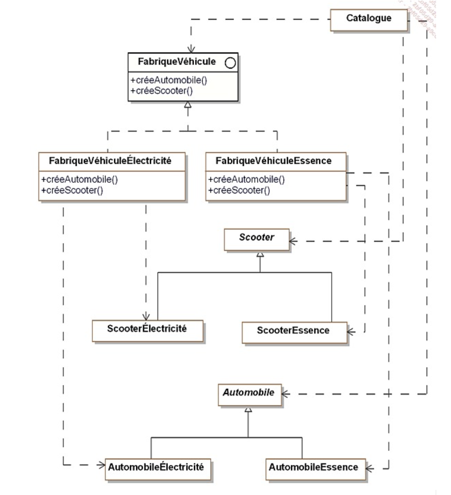

# ESI 4 - DESIGN PATTERNS EN C#

Livre : Design Patterns de 1995

## Chapitre 1​ Introduction aux patterns de conception

### 1.1. Design patterns ou patterns de conception

- Schema d'objets qui forme une solution a un probleme connu et frequent
- Ensemble de classes et de relation
- Dans le cadre de la POO
- Bases sur les bonnes pratiques

Patterns introduit pour la premiere fois dans le livre dit "GoF", Gang of Four en 1995.

Shéma en UML

### 1.2. La description des patterns de conception

- Le language UML et le C# (java, ...)
- Pour chaque pattern :
    - Nom
    - Description
    - Exemple sous forme UML
    - Structure generique du pattern
    - Le cas d'utilisation
    - Un exemple de code C#
    - (lien)


## ​​Chapitre 2 ​Une étude de cas : la vente en ligne de véhicules

### 2.1. Description du système

### ​2.2. Cahier des charges

- Vehicules destines a la vente
- Catalogue
- Options
- Panier / gestion de commandes

## ​​​​Chapitre 3​ Introduction aux patterns de construction

Une interface donne des éléments commun a toute les classes qui l'implemente.

### 3.2. Les problèmes liés à la création d’objets

En C#, une instruction de creation de classe :
```csharp
objet = new MyClass(); // creation d'une instance de la classe MyClass
```

Dans certains cas il est necessaire de parametrer la construction d'objets :

```csharp
public class Document
{
    public string Title { get; set; }
    public string Content { get; set; }
    public string Author { get; set; }
    public DateTime Created { get; set; }
}

public class Program {
    public Document CreateDoc(string typeDoc)
    {
        Document doc = null;

        if (typeDoc == "Word")
        {
            doc = new Document();
            doc.Title = "New Document";
            doc.Content = "Content";
        }
        else if (typeDoc == "Excel")
        {
            doc = new Document();
            doc.Title = "New Excel Document";
            doc.Content = "Excel Content";
        }
        else
        {
            doc = new Document();
            doc.Title = "New Document";
            doc.Content = "Content";
        }
    }
}

```

## Chapitre 4 Le pattern Abstract Factory

Créer un projet : dotnet new console -o NomDuProjet
Build : dotnet build
Run : dotnet run

### 4.1. Description

- Le but du pattern est la creation d'objets regroupes en familles sans devoir connaitre les classes concretes destinées a la création de ces objets.

- Signature de méthode : public void Document()




## Chapitre 5​ Le pattern Builder

### 5.1. Description

Composition : Mécanisme permettant a une classe de contenir une instance de cette meme classe ou d'une autre

.png>)

## Chapitre 7 Le pattern Prototype

### 7.1. Description

- Création de nouveaux objets par duplication d'objets existants
- On les appelle Prototype
- Capacité de clonages 


### 7.4. Domaines d’utilisation

- Le design pattern Prototype permet de créer des copies d'objets existants sans rendre le code dépendant de leurs classes concrètes. Au lieu de créer un objet a partir de zéro, on clone un objet existant (le prototype) et on le modifie si besoin.
- C'est comme faire une photocopie d'un document : on copie l'original et on peut modifier la copie
- L'avantage ^rincipal est la création d'objets complexes simplifié
- Cas d'usage :
    - Objets avec de nombreuse configuration (editeur graphique : formes geometriques)
    - En jeux vidéo, création d'enemis et leur variations en grande quantité
    - Création d'une configuration par defaut dans un jeu/logiciel (permet de restaurer le defaut rapidement et de configurer a nouveau)
    - Pour éviter la création d'objets systèmes couteux : connexions réseaux, ressources partagées...


## Chapitre 8 Le pattern Singleton

### 8.1. Description

- Le pattern Singleton permet d'assurer qu'une classe ne possede qu'une seule instance au cours de l'execution du programme
- Une methode de classe unique qui retourne cette instance

## Chapitre 9​ Introduction aux patterns de structuration

### 9.1. Présentation

- Facilite l'indépendance de l'interface d'un objet vis-à-vis de son implémrntation. Dans le cas d'un ensemble d'objets, il s'agit aussi de rendre cette interface indépendante de la hiérarchie des classes et de la composition des objets.
- Les patterns de structuration encapsule la composition des objets (augmentation du niveau d'abstraction)
- Précédemment les patterns de création encapsulaient la création des objets.

## Chapitre 10​ Le pattern Adapter

### 10.1. Description

- Convertir l'interface d'une classe existante en une interface attendue par ses clients (afin qu'ils puissent travailler ensemble)
- Autrement dit c'est fournir une nouvelle 


## Chapitre 11​ Le pattern Bridge

### 11.1. Description

- Séparer l'aspect d'implémentation d'un objet de son aspect représentation et d'interface

## Chapitre 13​ Le pattern Decorator

### 13.1. Description

- Le but du pattern est d'ajouter dynamiquement des fonctionnalités supplementaires à un object
- Aucune modification de l'interface de l'objet
- Transparent vis-a-vis des clients
- Une alternative à la création d'une sous-classe pour enrichir un objet

## Chapitre 17​ Introduction aux patterns de comportement

### 17.1. Présentation

- Objectif : fournir des solutions pour distribuer les traitements et les algorithmes entre les objecs.

## Chapitre 18​ Le pattern Chain of Responsibility

### 18.1. Description

- Construit une chaine d'objets telle que si un objet de la chaine ne peut pas répondre a la requete, il puisse la transmettre a son successeur jusqu'à ce que l'un des objets répondent

### 18.2. Exemple

- Catalogue de véhicule 
- Description de véhicule
- Liaison d'objet en allant du plus spécifique (véhicule) au mois spécifique (description par défaut)

### 18.4. Domaines d’application

- Une chaine d'objets doit gérer une requetes selon un ordre défini dynamiquement
- La facon dont une chaine d'objets gère une reqete ne doit pas etre connue par ses clients

## Chapitre 19 ​Le pattern Command

### 19.1. Description

- Command permet de transfirmer une requete en un objet, ce qui facilite les opérations comme les annulations ou les "retour en arrière", ou encore les mises en file d'attente des demandes et leur suivi.


# DS

## Exo1:

1. L'ajout ou la modification de nouveaux traitements est difficile  sans devoir toucher au code existant​​.

2. Pour ajouter un nouveau traitement au code, il faudrait introduire un design pattern comme le Decorator pour que les traitements sois sous forme de classes séparées. Cela permettrait d'ajouter ou de modifier des traitements facilement​.

Mais si on utilise l'a facon de faire actuel il faut :
Ajouter une nouvelle propriété booléenne pour l'état du traitement.
Ajouter une méthode qui active ce traitement avec la propriété à true.
Modifier la méthode GetContenu() pour avoir une condition pour la logique du nouveau traitement

3. L'ajout de multiples traitements combinés dans le code actuel modifie GetContenu en la rendent plus grosse et plus complexe, ce qui est difficile à maintenir et à étendre.

4. Le composant de base est l'interface IRapport, implémentée par RapportIncident. Les décorateurs sont RapportDecorator (classe abstraite), RapportAnonyme, RapportChiffre, RapportSigne, et RapportJournalise, qui héritent tous de RapportDecorator.

5. On utilise l'interface IRapport pour définir des méthodes commune (GetContenu et GetAuteur) que doivent respecter les composants, RapportIncident ou RapportDecorator. Cela permet d'utiliser les décorateurs sans que le code client connaisse leurs détails.

6. RapportDecorator sert de base pour les décorateurs. Elle délègue les appels aux méthodes, et permet aux sous-classes d'ajouter ou de modifier des comportements.

7. 
using System;

// Interface IRapport
public interface IRapport
{
    string GetContenu();
    string GetAuteur();
}

public class RapportIncident : IRapport
{
    private string contenu;
    private string auteur;

    public RapportIncident(string contenu, string auteur)
    {
        this.contenu = contenu;
        this.auteur = auteur;
    }

    public string GetContenu()
    {
        return contenu;
    }

    public string GetAuteur()
    {
        return auteur;
    }
}

public abstract class RapportDecorator : IRapport
{
    protected IRapport rapport;

    public RapportDecorator(IRapport rapport)
    {
        this.rapport = rapport;
    }

    public virtual string GetContenu()
    {
        return rapport.GetContenu();
    }

    public virtual string GetAuteur()
    {
        return rapport.GetAuteur();
    }
}

public class RapportAnonyme : RapportDecorator
{
    public RapportAnonyme(IRapport rapport) : base(rapport) { }

    public override string GetContenu()
    {
        return rapport.GetContenu().Replace("identifiant", "***").Replace("password", "***");
    }

    public override string GetAuteur()
    {
        return "ANONYME";
    }
}

public class RapportChiffre : RapportDecorator
{
    public RapportChiffre(IRapport rapport) : base(rapport) { }

    public override string GetContenu()
    {
        var contenu = rapport.GetContenu();
        return Convert.ToBase64String(System.Text.Encoding.UTF8.GetBytes(contenu));
    }
}

class Program
{
    static void Main(string[] args)
    {
        IRapport rapport = new RapportIncident(
            "Intrusion détectée. identifiant: admin, password: 123456",
            "John Doe"
        );

        Console.WriteLine($"Auteur : {rapport.GetAuteur()}");
        Console.WriteLine($"Contenu : {rapport.GetContenu()}");
    }
}

8. 

class Program
{
    static void Main(string[] args)
    {
        IRapport rapport = new RapportIncident(
            "Intrusion détectée. identifiant: admin, password: 123456",
            "John Doe"
        );
        rapport = new RapportAnonyme(rapport);
        rapport = new RapportChiffre(rapport);

        Console.WriteLine($"Auteur : {rapport.GetAuteur()}");
        Console.WriteLine($"Contenu : {rapport.GetContenu()}");
    }
}

9. Par exemple, si ont applique d'abord RapportChiffre puis RapportAnonyme, sa rendra l'anonymisation inutile car les données sensibles seront déjà chiffrées. Et appliquer RapportAnonyme avant RapportChiffre garantit que les données sont anonymisées avant d'être chiffrées​.

10. Un exemple concret est la création d'un rapport contenant des données sensibles, comme : "identifiant: admin, password: 123456". Si le décorateur RapportChiffre est appliqué avant RapportAnonyme, les données seront chiffrées sans être anonymisées, et donc sa expose les informations une fois déchiffrées. Et appliquer d'abord RapportAnonyme garantit que les données sensibles sont masquées avant d'etre ciffrer, donc meilleure sécurité​.

## Exo2 :

11. Il peut y avoir une incohérence des logs si plusieurs instances écrivent dans le même fichier ou base de données. Sa augmentent le risque d'erreurs et rend le système difficile à maintenir​.

12. La gestion actuelle des ressources pose problème car chaque instance de SystemLogger ouvre indépendamment le fichier ou la connexion à la base de données, ce qui peut entraîner des conflits d'accès et des corruptions de données. 
Si plusieurs services écrivent simultanément dans le fichier, des exceptions ou des erreurs d'écritures peuvent se produire, rendant les logs incohérents.

13. Le design pattern Singleton. Il sert justement a garantir une seul instance, il en crée une uniquement si il y en a pas encore, sinon il conserve la meme.

14. Ce pattern assure qu'une classe n'a qu'une seule instance active pendant l'exécution du programme.
Cela résoudrait les problèmes en évitant ainsi la duplication des connexions​.

15. 
public class SystemLogger
{
    private static SystemLogger _instance = null;
    private StreamWriter logFile;

    private SystemLogger()
    {
        logFile = new StreamWriter("system_logs.txt", true);
    }

    public static SystemLogger GetInstance()
    {
        if (_instance == null)
          _instance = new SystemLogger ();
        return _instance;
    }

    public void Log(string message)
    {
        string timestamp = DateTime.Now.ToString("yyyy-MM-dd HH:mm:ss");
        logFile.WriteLine($"[{timestamp}] {message}");
        logFile.Flush();
    }
}

16. 
